In this modern age, where internet and computers are so ubiquitous, many indiviuals and businesses would like to 
have their own website. A website can be used to tell web-surfers about yourself, your interests, or other pertinant 
information think is worth sharing. Fortunately there are many services that can be used to create your own  website 
and host it. These services vary widely in their cost, ease of use and features.

Aspiring website administrators may consider using AWS to host their site. It may not be as user friendly as some other
services, but it provies a lot more flexibility. What's more, the extra work you will have to do to deploy your website
on AWS may bring you a nice sense of accomplishment. It will be a good learning experience, and an added bonus is that
having some AWS experience will look good on your CV.

This post will cover the steps necessary to deploy your static website on AWS. It will describe how to host the website
using S3, use ACM to create a TLS certificate for your site, and use CloudFront to enable HTTPS and caching. I'll also 
be using Route53 to register my domain name, but this is by no means a requirement. If you've registered your domain
already using some other DNS service, you can skip part one.

Here are the prerequisites:
- AWS Account - If you don't have one already you can
  [create one](https://aws.amazon.com/premiumsupport/knowledge-center/create-and-activate-aws-account/)
- Static content for website - You can build your own website with the content you want to show the internet. If you
  don't have a site built, you can [download](/aws-site-setup-example-site.zip), extract and use the files from this 
  exmaple to follow along

## 1. Register your Domain

First a domain will be needed to use for the website. Route53 can be used to register it.

TODO write this section

## 2. Create an S3 Bucket for your site

In the [AWS Console](https://console.aws.amazon.com/console/home) click on _Services_ and then search for S3. Clicking
S3 should take you to the [S3 home page](https://s3.console.aws.amazon.com/s3/home).

Now create a new bucket to hold the static content for the site
- Click the _Create bucket_ button
  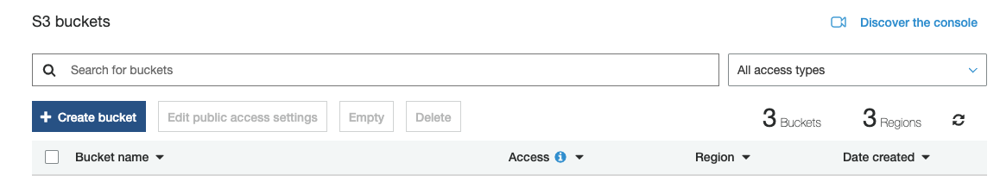

- In the _Bucket name_ input, give it the domain-name of your website (i.e "albertlockett.ca"), click Next
 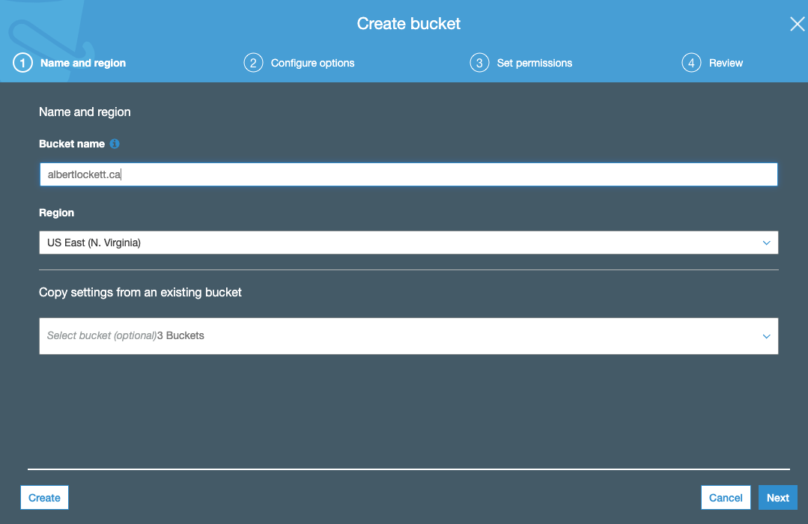
- Leave all defaults on Page 2, click next
- On Page 3 (_Set Permissions_ page), uncheck _Block all public access_, and then _I acknowlegdge..._ in the dialog that
  is then displayed. click Next
  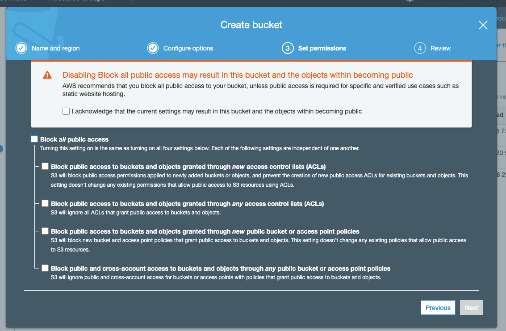
- On Page 4 click _Create bucket_


Your bucket will now display on the S3 buckets page. The next step is to configure it for static web hosting. 
- Click on the name of the bucket, and then click on the Properties tab on the bucket details page. 
  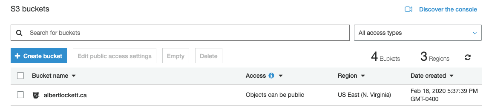
- Click on _Static website hosting_.
  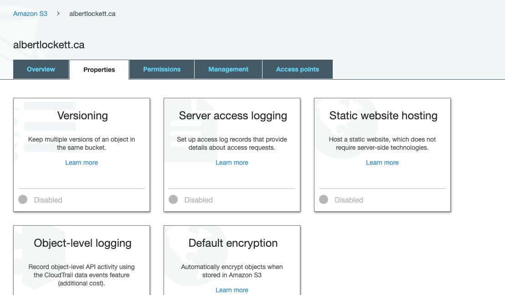
- In the Static website hosting form, type "index.html" in the _Index document_ field and click _Save_
  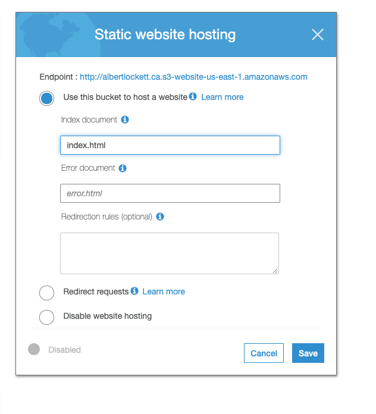

Now add a Bucket Policy to allow your users to request access to your wbesite's files:
- Click on the Permissions tab
- Click on Bucket Policy
- Enter the following Bucket Policy (make sure to change "albertlockett.ca" to the domain from Step 1 for the bucket's 
  name)
  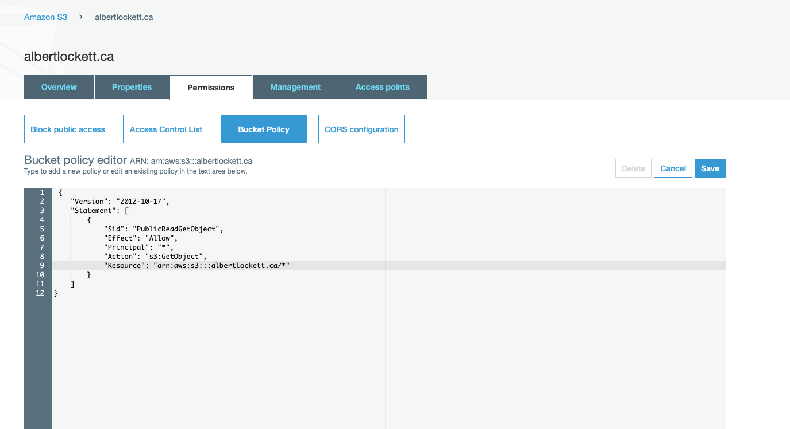

```
{
    "Version": "2012-10-17",
    "Statement": [
        {
            "Sid": "PublicReadGetObject",
            "Effect": "Allow",
            "Principal": "*",
            "Action": "s3:GetObject",
            "Resource": "arn:aws:s3:::albertlockett.ca/*"
        }
    ]
}
```

Next we need to upload the content for the static site into the S3 bucket.
- On the _Overview_ tab click the _Upload_ button
- Click _Add Files_ and choose all the files for your website, click Next 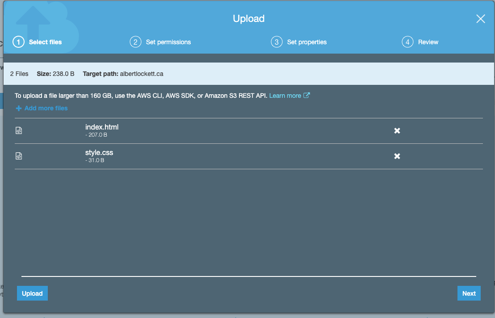
- On the _Set Permissions_ page, in the section called _Manage Public Permissions_ choose _Grant Public Read Access 
  to this Object(s) 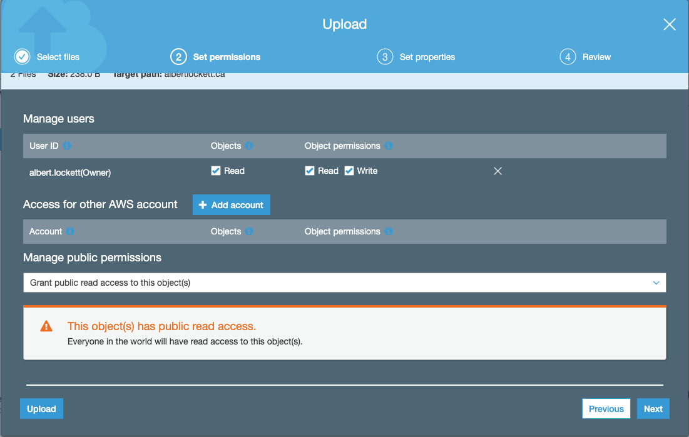
- Click Next on Page 3 to accept defaults 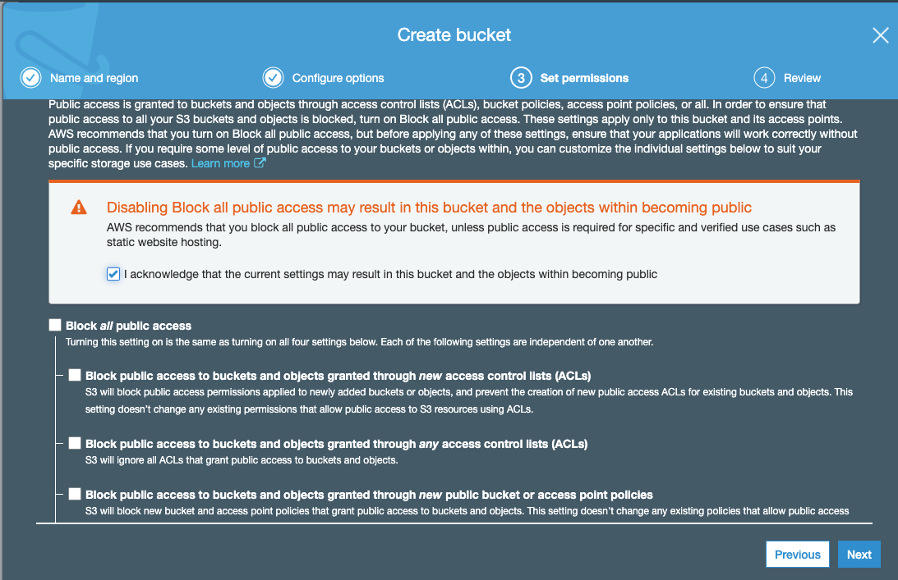
- Click Upload

TODO put hint here about using the CLI

Now you'll see your objects in the bucket.
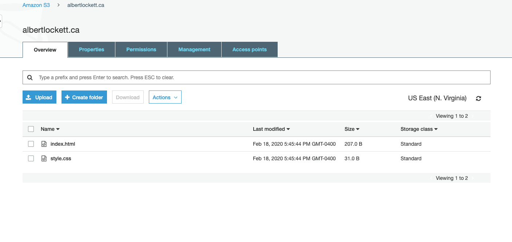

Now we can test our bucket is configured correctly. In your web browser, navigate to your bucket's URL like this
(change albertlockett.ca for your bucket name). You can also get the bucket name Properties -> Static Web Hosting and 
the link is beside a label called Endpoint.

http://albertlockett.ca.s3-website-us-east-1.amazonaws.com/

You have the option now to create a DNS alias record for your domain to 
albertlockett.ca.s3-website-us-east-1.amazonaws.com, but this has two disadvantages:
- You wont be able to serve your content over HTTPS
- You might have trouble using a client-side routing library like react-router. Say your users navigate to "/route" in
  your app, if they refresh the page they'll get the S3 403 response.

The following sections of these instructions show how to set up CloudFront to solve against these problems

## 3 Create a CloudFront Distrbution

CloudFront is a service that allows you to have your static content distributed and cached on AWS's CDN. While that's
nice for performance, using CloudFront also allows us to serve the content over HTTPS and it allows us to use custom
error pages. We can use this custom error page functionality to return /index.html for any GET requests for content that
isn't in our bucket. This is especially useful for sites using a client-side routing framework like react-router.

In the [AWS Console](https://console.aws.amazon.com/console/home) click on _Services_ and then search for CloudFront. 
Clicking CloudFront should take you to the [CloudFront home page](https://console.aws.amazon.com/cloudfront/home). On
this page, click _Create Distribution_. 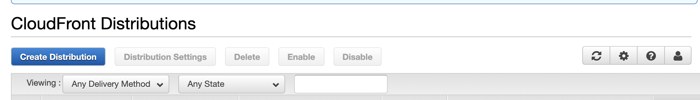

- Chose _Get Started_ under the _Web_ section. You'll be taken to the _Create Distribution_ form
  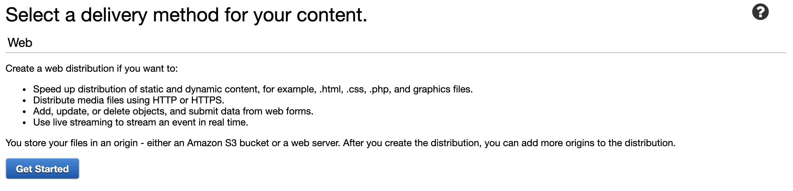
- In the _Origin Settings_ section, in the _Origin Domain Name_ field, choose your new bucket (for example: 
  albertlockett.ca.s3.amazonaws.com)
- In the _Distribution Settings_ section, choose _Use Only U.S., Canada and Europe_ in the Price Class setting (this is
  the cheapest option).
- Click _Create Distribution_

AWS will begin provisioning your CloudFront distribution. You'll see your distribution with Status of _In Progress_. It 
can take quite a while for the service to provision. 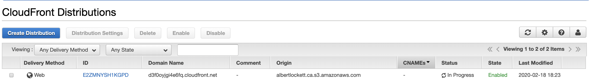

You can also see CloudFront creates a domain name for your distribution (i.e., d3f0oyjgi4e6fq.cloudfront.net). Once your 
distribution status changes to _Deployed_, you should be able to paste this in your browser and be taken to your site.

_Note_ you'll have to request an actual resource like /index.html, otherwise you'll get a 403 message. e.g.
http://d3f0oyjgi4e6fq.cloudfront.net/index.html

This is not ideal, but we can get the right content by setting up a custom error response. 

- Click on the ID link of your distribution
- Click on the Error Pages tab
- Click Create Custom Error Response 
- Choose _HTTP Error Code_ - _403: Forbidden_
- Choose _Customie Error Response_ - _Yes_
- In Response Page Path type _/index.html_
- Choose _HTTP Response Code_ - _200: OK_
- Click _Create_ 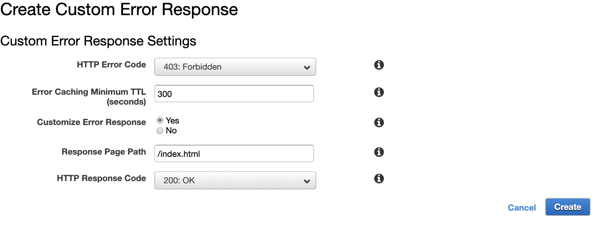

Your distribution may enter the _In Progress_ status again after setting up the custom error response. After some time,
you should be able to go to "/" at your CloudFront domain and get the right content (i.e. 
http://d3f0oyjgi4e6fq.cloudfront.net/)


# 4 Use your custom domain for CloudFront

You can now create an Alias record on your custom Domain, but CloudFront won't serve the content unless you configure
CloudFront with an SSL Certificate, so we'll set one of those up first. There are probably many options to get yourself
a cert but I'm going to use AWS's Certificate Manager (ACM) service.

Note that to request a cert through ACM, you either need access to create DNS records for that domain, or you need 
access to the WHOIS contact info for the domain (or one of the admin email addresses).

In the [AWS Console](https://console.aws.amazon.com/console/home) click on _Services_ and then search for Certificate 
Manager. Clicking CloudFront should take you to the [ACM home page](https://console.aws.amazon.com/acm/hom). On
this page, click _Request a certificate_.

- Choose Request a public certificate
- In the _Add domain names_ form, type your domain name and click Next 
  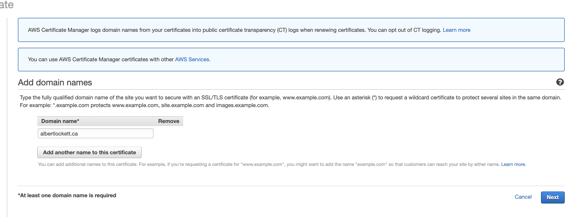
- Here there are two options for validating that you are the owner of the cert. I'm going to use DNS Validation but if
  you want to use email validation you can do that 
  [here](https://docs.aws.amazon.com/acm/latest/userguide/gs-acm-validate-email.html). Choose _DNS Validation_
- Add tags if you like, or click _Review_
- Click _Confirm and Request_
  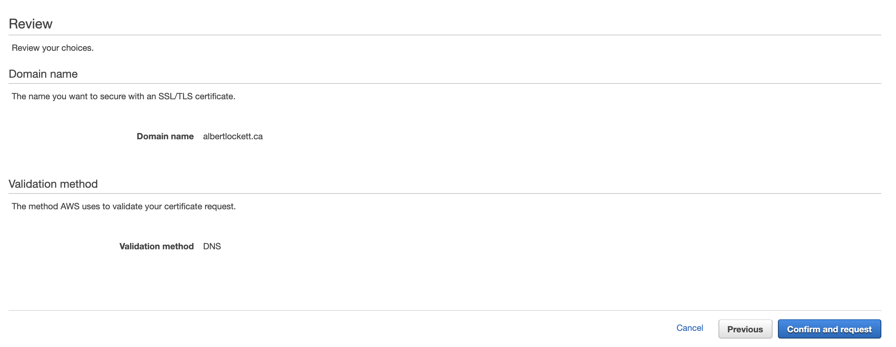

You'll now have to go through a validation process with AWS to have the cert issued. If you're using DNS validation,
you'll see that it wants you to create a CNAME entry with your DNS provider in order to validate the cert. 
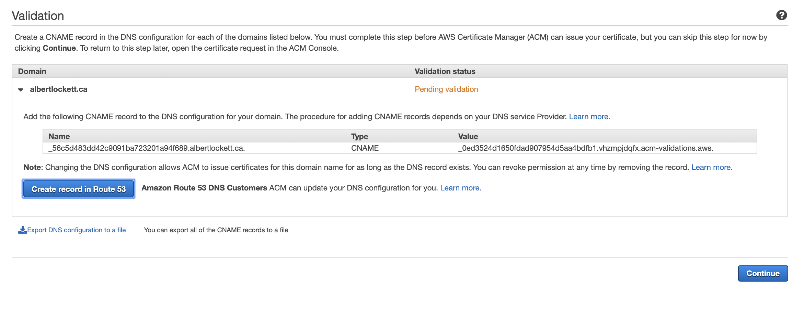 
If you're using Route 53, just click _Create Record in Route 53_ and it will create the validation record automatically.

Also note it may take up to 30 minutes for the changes to propagate, and for AWS to validate the domain.

After Validation you can click _Continue_.

Now it's time to configure the CloudFront distribution with your custom domain name and SSL cert. 
- Go to CloudFront and clikc on the ID link for your distribution
- Click Edit
  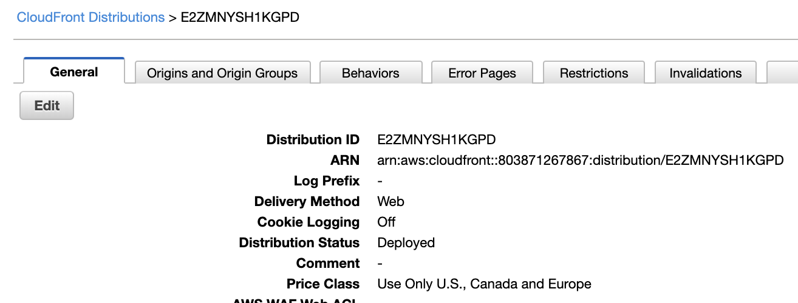 
- In the box that says _Alternate Domain Names (CNAMEs)_ type your custom domain name (e.g. albertlockett.ca)
- In the _SSL Certificate_ field, choose _Custom SSL Certificate (example.com):_
- In the textbox, choose your cert
  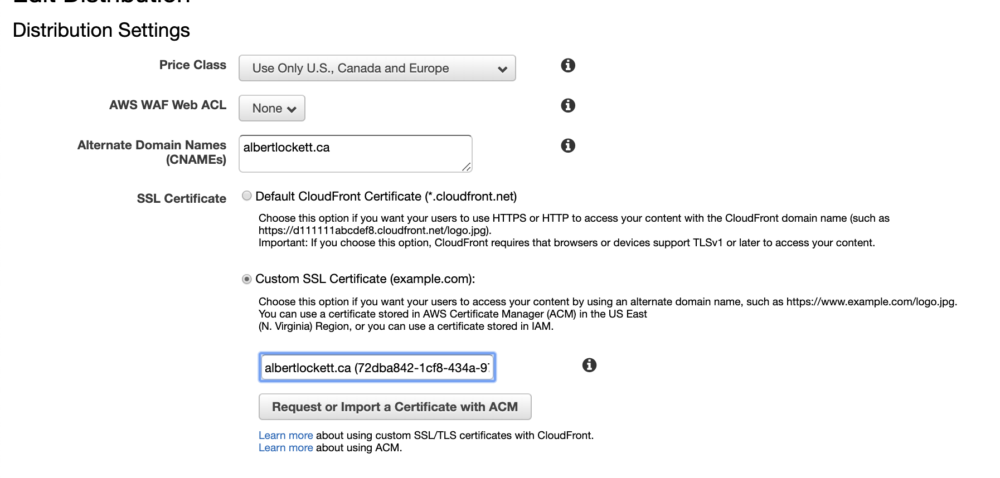 
- click _Yes, Edit_ at the bottom of the form

Your CloudFront distribution will enter the _In Progress_ state again. After it's done you should be able to access 
your site at your own domain name:


<!-- TODO pics in browser of this -->
http://albertlockett.ca

or using HTTPS

https://albertlockett.ca


TODO proofread document

# Appendix B Creating DNS records in Route 53
TODO write this

<!-- give further reading links -->